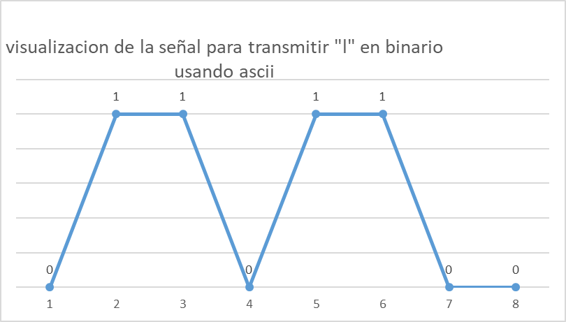
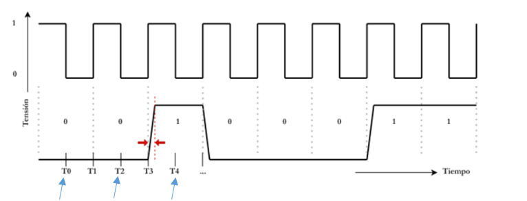
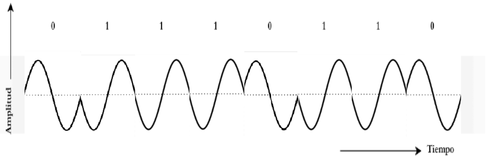

<div align="center">


# Universidad Nacional de Córdoba
### Facultad de Ciencias Exactas, Físicas y Naturales

**Cátedra Redes de Computadora**
## Trabajo Práctico 1

</div>

---

### 👥 Alumnos

| Nombres | DNI |
|---|---|
| Monetti, Francisco | 46590584 |
| Toranzo, Hernan | 44345504 |
| Silva, Jonathan Ariel | 42641133 |
| Barron Saez, Lautaro | 44909179 |
| Hernandez, Gonzalo Nicolas | 42246081 |
| Michaud, Facundo | 47302808 |

**Agosto 2026**

---

## 📑 Índice

- [1) Conceptos básicos de señales](#1-conceptos-básicos-de-señales)
  - [b) Frecuencia de la onda](#b-frecuencia-de-la-onda)
  - [c) Región del espectro](#c-región-del-espectro)
  - [d) Dispositivos en la banda SHF](#d-dispositivos-en-la-banda-shf)
  - [e) Línea de trazos roja](#e-línea-de-trazos-roja)
  - [f) Efecto de la atenuación](#f-efecto-de-la-atenuación)
  - [g) Afectación en distintos medios de transmisión](#g-afectación-en-distintos-medios-de-transmisión)
    - [i) Telefonía celular](#i-telefonía-celular)
    - [ii) Cable coaxial](#ii-cable-coaxial)
    - [iii) Fibra óptica](#iii-fibra-óptica)
- [2) Sistema de transmisión](#2-sistema-de-transmisión)
  - [a) Tipo de transmisión y modo](#a-tipo-de-transmisión-y-modo)
  - [b) Análisis de la transmisión](#b-análisis-de-la-transmisión)
  - [c) Representación en ASCII](#c-representación-en-ascii)
  - [d) Marcas temporales de muestreo](#d-marcas-temporales-de-muestreo)
- [3) Transmisión inalámbrica de una señal escalonada](#3-transmisión-inalámbrica-de-una-señal-escalonada)
  - [a) Técnica de modulación representada](#a-técnica-de-modulación-representada)
  - [b) Gráfico de la señal PSK](#b-gráfico-de-la-señal-psk)
  - [c) Otras técnicas de modulación](#c-otras-técnicas-de-modulación)
  - [d) Bit Error Rate (BER)](#d-bit-error-rate-ber)
- [4) Configuración de red](#4-configuración-de-red)
  - [c) Frecuencia y banda del router](#c-frecuencia-y-banda-del-router)
  - [g) Configuración de IPs y prueba de conectividad (PING)](#g-configuración-de-ips-y-prueba-de-conectividad-ping)

---

## CONSIGNAS

## 1) Conceptos básicos de señales

A continuación se presentarán una serie de conceptos básicos respecto a las señales.

- **Ondas electromagnéticas:** Son aquellas ondas formadas por un campo eléctrico y un campo magnético que oscilan perpendicularmente entre sí, propagándose a la velocidad de la luz. No necesitan de un medio material para propagarse, por lo que pueden hacerlo tanto a través del vacío como de medios físicos.

- **Modulación/Demodulación:** La modulación es un proceso que ocurre en el transmisor. Esta consiste en modificar alguna propiedad de una onda de alta frecuencia (señal portadora) usando la información de la señal original que se quiere transmitir (señal moduladora). Se puede utilizar para obtener un mayor alcance de transmisión, evitar transferencias, etc.

  La demodulación es un proceso inverso a la modulación que ocurre en el receptor. Consiste en recuperar la señal original a partir de la onda portadora modificada que se recibió por el medio de transmisión.

- **Señales de tiempo continuo:** Son aquellas señales que están definidas para cualquier instante de tiempo dentro de un intervalo determinado, intervalo dentro del cual pueden tomar cualquier valor real. Las señales analógicas son un ejemplo de señales de tiempo continuo, tal como las señales acústicas, eléctricas, etc.

- **Señales de tiempo discreto:** Son aquellas señales que solo están definidas para instantes de tiempo específicos, separados entre sí. En este caso la señal solo puede tomar valores enteros concretos, no cualquier valor real. Las señales digitales son aquellas que dominan esta categoría, tal como señales de temperatura y de audio que fueron tomadas con un sensor y procesadas por un microcontrolador, el conteo del ingreso de personas a un edificio durante una hora, etc.

### b) Frecuencia de la onda

La onda tiene una longitud de onda de 60 [mm], eso significa que tiene una frecuencia:

```
f = C / λ = ( 3×10⁸ [m/s] ) / ( 0,06 [m] ) = 5×10⁹ [Hz]
```

### c) Región del espectro

La onda opera en la región de las microondas, específicamente en la banda 10 / SHF (Super High Frequency), que corresponde a la subdivisión métrica de ondas centimétricas (B.cm) según la clasificación de la ITU.

### d) Dispositivos en la banda SHF

La banda 10 / SHF corresponde al rango de frecuencias de 3 GHz - 30 GHz (de acuerdo a la clasificación ITU). En la actualidad hay una gran cantidad de dispositivos para comunicaciones de datos dentro de esta banda. Algunos ejemplos de ellos son aquellos relacionados a los puntos de Acceso Wi-Fi y Enrutadores (WLAN). En este caso, los routers domésticos y empresariales utilizan sub-bandas dentro del rango SHF para proveer conexión inalámbrica a redes locales e internet. Sus frecuencias habituales son: 5 GHz (802.11a/n/ac/ax/be) y 6 GHz (Wi-Fi 6E y Wi-Fi 7). Algunos dispositivos de ejemplo en específico son los routers personales/empresariales.

### e) Línea de trazos roja

La línea de trazos roja representa el fenómeno de atenuación de la onda, también conocido como amortiguamiento o pérdida de intensidad.

### f) Efecto de la atenuación

El fenómeno de atenuación de la onda de hecho es la razón principal por la que una señal de WI-FI pierde fuerza a mayores distancias, por lo que los routers son dispositivos que se ven afectados directamente por este fenómeno. Además, es algo que podemos notar diariamente con las frecuencias de 5 GHz, pues si bien son muy rápidas, a medida que nos alejamos poco a poco de la habitación del router, la calidad de la conexión disminuye rápidamente hasta que finalmente el dispositivo conectado a la red se termina desconectando.

### g) Afectación en distintos medios de transmisión

#### i) Telefonía celular

Si afecta las transmisiones de telefonía celular, las ondas de radio de alta frecuencia transmitidas entre la antena y tu teléfono pierden energía a medida que se propagan por el aire. Además, el follaje de los árboles, la lluvia, los edificios y las paredes absorben y dispersan la señal.

#### ii) Cable coaxial

Si afecta las transmisiones de cable coaxial, la señal eléctrica sufre pérdidas de energía por la resistencia del conductor de cobre (efecto Joule), las pérdidas en el material aislante (dieléctrico) y el efecto pelicular (la corriente tiende a viajar solo por la superficie del metal a altas frecuencias).

#### iii) Fibra óptica

Si afecta las transmisiones de fibra óptica, pierde intensidad debido a la dispersión de Rayleigh (imperfecciones microscópicas en el núcleo de vidrio que desvían la luz) y a la absorción molecular del propio vidrio.

---

## 2) Sistema de transmisión

### a) Tipo de transmisión y modo

El sistema representado corresponde a una transmisión de tipo Simplex y modo Síncrono. Debido a que la comunicación fluye estrictamente en un único sentido, desde el emisor hacia el receptor, sin posibilidad de retorno de información. Además existe una línea dedicada a transmitir una señal de reloj (clock) desde el emisor al receptor, la cual sincroniza la lectura de los bits en ambos extremos, lo que asegura un flujo de tiempo compartido.

### b) Análisis de la transmisión

La transmisión con el actual paradigma sólo se envían datos de manera unidireccional así que no se puede emitir de forma bidireccional; en cuanto a si es la forma más rápida, la tasa de transmisión se ve reducida al ser síncrona, debido a que la misma es de un solo canal, por lo tanto no es la mejor forma si lo que se busca es una transmisión bidireccional y rápida.

### c) Representación en ASCII

Representación de la cuarta letra de los bits en forma de señal digital con formato ASCII.

> "l" = 108 en ASCII, por lo cual en binario sería `01101100`

<div align="center">

</div>

### d) Marcas temporales de muestreo

Dada la pendiente en los niveles de tensión que podemos ver indicada con flechas en el gráfico de ejemplo. ¿En qué marcas temporales medirían la señal para determinar el valor digital de la misma?

<div align="center">

</div>

Mediría la señal en los tiempos T0, T2, T4 y así sucesivamente, evitando los tiempos impares.

---

## 3) Transmisión inalámbrica de una señal escalonada

Transmitir una señal escalonada de manera inalámbrica no es conveniente por los siguientes motivos:

- **Requiere ancho de banda infinito (Teorema de Fourier):** De acuerdo a Fourier, una señal con saltos bruscos (que son como discontinuidades en el tiempo) se compone de una frecuencia fundamental y una cantidad infinita de armónicos. Eso significa que una señal escalonada "perfecta", al poseer esos saltos bruscos, requeriría de un ancho de banda infinito que no es posible. En la realidad, cuando la señal pasa por un canal o filtro inalámbrico, se produce el efecto de Gibbs, produciendo que el receptor vea la señal deformada (perdiendo su forma de escalón).

- **Ineficiencia en antenas y medios inalámbricos:** Como las antenas están diseñadas para ser eficientes en un rango estrecho de frecuencias (alrededor de la frecuencia central), una señal escalonada, que distribuye su energía a lo largo de un gran rango de frecuencias, termina resultando en que la antena no pueda radiar de manera eficiente la mayor parte de la energía de esta, terminando en una transmisión ineficiente.

- **Gran interferencia:** Debido a que las componentes espectrales de alta frecuencia de una señal escalonada se extienden mediante un espectro enorme, la señal terminaría interfiriendo con otros canales y servicios de radio próximos, además de generar ruido en otros dispositivos que se encuentren cerca.

- **Presencia de componente de DC:** Una señal escalonada posee una componente de DC (frecuencia de 0 Hz), y como las antenas requieren campos electromagnéticos variables en el tiempo para propagarse por el aire, la componente de DC nunca se transmitiría.

### a) Técnica de modulación representada

Se está representando la técnica de modulación llamada modulación por desplazamiento de fase o PSK (*Phase Shift Keying*).

### b) Gráfico de la señal PSK

<div align="center">

</div>

### c) Otras técnicas de modulación

Otras técnicas de modulación basadas en modificar uno o más de los tres parámetros fundamentales de una señal analógica portadora son:

- **ASK (Amplitude Shift Keying / Desplazamiento de Amplitud):** Representa los bits modificando la amplitud de la portadora (comúnmente transmitiendo señal para el 1 y silencio para el 0)
- **FSK (Frequency Shift Keying / Desplazamiento de Frecuencia):** Representa los bits variando la frecuencia de la portadora (usando una frecuencia f1 para el 1 y una frecuencia f2 para el 0)
- **QPSK (Quadrature Phase Shift Keying):** Una variante avanzada de PSK que utiliza 4 fases desfasadas en múltiplos de 90° (π/2), lo que permite codificar 2 bits por cada elemento de señal (símbolo) y duplicar la eficiencia de transmisión
- **QAM (Quadrature Amplitude Modulation):** Una técnica híbrida muy potente que combina variaciones simultáneas de amplitud (ASK) y fase (PSK)

### d) Bit Error Rate (BER)

El Bit Error Rate (BER), o Tasa de Errores por Bit (también denominada en la bibliografía como fracción de errores por bit), es la métrica estándar y más habitual utilizada para evaluar la calidad y la fiabilidad de cualquier enlace de transmisión de datos digitales.

Algunos factores determinantes que afectan al BER son:

- **La Relación Señal-Ruido (SNR o el cociente Eb/N0):** Es el factor físico más crítico. Un aumento en la relación señal-ruido reduce drásticamente la tasa de errores (BER) debido a que la señal deseada destaca con mayor claridad por encima del ruido de fondo, facilitando la tarea de decisión del receptor.
- **La velocidad de transmisión (R):** Si se incrementa la velocidad de datos, la duración temporal de cada bit se hace más "corta". Ante un mismo patrón o impulso de ruido, un bit más corto es mucho más fácil de corromper, lo que eleva el BER.
- **El ancho de banda (B):** Aunque un mayor ancho de banda permite velocidades más altas, en sistemas con ruido blanco térmico, abrir el ancho de banda del receptor introduce más ruido al sistema, lo que disminuye la relación señal-ruido y puede empeorar el BER.
- **El esquema de codificación o modulación:** El método elegido para mapear los bits en la señal portadora define qué tan expuesta está la información a las alteraciones del canal.

Las técnicas basadas en PSK (BPSK y QPSK) son las que tienen mejores prestaciones. Si observamos las curvas de probabilidad de error según la relación señal-ruido (Figura 5.4 del libro), BPSK/QPSK requiere aproximadamente 3 dB menos de potencia (la mitad de energía por bit) que ASK o FSK para lograr exactamente la misma tasa de error. Esto las hace significativamente más robustas frente al ruido y las interferencias del canal.

---

## 4) Configuración de red

### c) Frecuencia y banda del router

El router opera en la región de las microondas, a una frecuencia de 2,437 GHz, operando en la banda 9 / UHF (300 - 3.000 MHz), en la subdivisión de ondas decimétricas (B.dm) según la clasificación de la UTI.

### g) Configuración de IPs y prueba de conectividad (PING)

| Dispositivo | Dirección IPv4 | Subred | Enlace |
|---|---|---|---|
| Notebook0 | 192.168.0.101 | 255.255.255.0 | 192.168.0.1 |
| PC0 | 192.168.0.100 | 255.255.255.0 | 192.168.0.1 |

**Registro de pruebas de conectividad:**

**PING desde Notebook0 a PC0:**

```
C:\>ping 192.168.0.100

Pinging 192.168.0.100 with 32 bytes of data:

Reply from 192.168.0.100: bytes=32 time=22ms TTL=128
Reply from 192.168.0.100: bytes=32 time=13ms TTL=128
Reply from 192.168.0.100: bytes=32 time=11ms TTL=128
Reply from 192.168.0.100: bytes=32 time=14ms TTL=128

Ping statistics for 192.168.0.100:
    Packets: Sent = 4, Received = 4, Lost = 0 (0% loss),
Approximate round trip times in milli-seconds:
    Minimum = 11ms, Maximum = 22ms, Average = 15ms
```

**PING desde PC0 a Notebook0:**

```
C:\>ping 192.168.0.101

Pinging 192.168.0.101 with 32 bytes of data:

Reply from 192.168.0.101: bytes=32 time=11ms TTL=128
Reply from 192.168.0.101: bytes=32 time=8ms TTL=128
Reply from 192.168.0.101: bytes=32 time=4ms TTL=128
Reply from 192.168.0.101: bytes=32 time=11ms TTL=128

Ping statistics for 192.168.0.101:
    Packets: Sent = 4, Received = 4, Lost = 0 (0% loss),
Approximate round trip times in milli-seconds:
    Minimum = 4ms, Maximum = 11ms, Average = 8ms
```

**Conclusiones:**

Las pruebas realizadas mediante el comando `ping` confirman una comunicación bidireccional exitosa y sin pérdida de paquetes (0%) entre la Notebook y la PC0. Esto evidencia una correcta configuración y asignación de direcciones IP dentro de la misma red local, en la subred 255.255.255.0. Además, los tiempos de respuesta obtenidos son bajos y estables, con promedios de entre 8 y 15 milisegundos, lo que indica que el enlace mixto (LAN/WLAN) a través del router funciona de manera correcta, sin saturación ni interferencias que afecten a la transmisión de datos.
