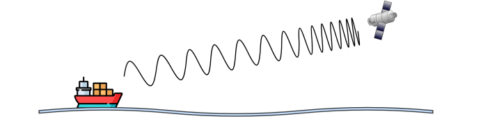
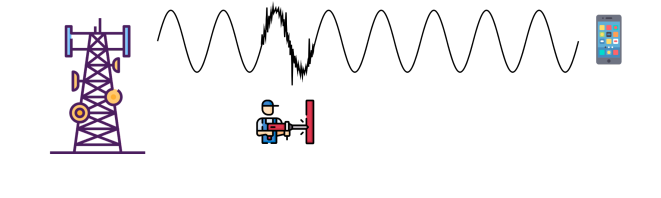
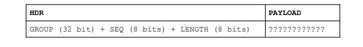
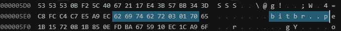

# Trabajo Práctico 2 — Redes de Computadoras

**Universidad Nacional de Córdoba**  
**Facultad de Ciencias Exactas, Físicas y Naturales**  
**Cátedra: Redes de Computadoras**  

**Alumnos:**

| Nombre | DNI |
|--------|-----|
| Monetti, Francisco | 46590584 |
| Toranzo, Hernan | 44345504 |
| Silva,Jonathan Ariel | 42641133 |
| Barron Saez, Lautaro | 44909179 |
| Hernandez, Gonzalo Nicolas | 42246081 |
| Michaud, Facundo | 47302808 |

**Agosto 2026**

---

## Índice

- [**CONSIGNAS**](#consignas)
  - [1) Efecto Doppler](#consigna-1)
  - [2) Ruido e interferencia electromagnética / SNR](#consigna-2)
  - [3) Sistemas de transmisión digital](#consigna-3)
  - [4) Tramas, sincronización y protocolos](#consigna-4)
  - [5) Extracción de payload](#consigna-5)
- [**RESPUESTAS**](#respuestas)
  - [1) Efecto Doppler](#respuesta-1)
  - [2) Ruido e interferencia electromagnética / SNR](#respuesta-2)
  - [3) Sistemas de transmisión digital](#respuesta-3)
  - [4) Tramas, sincronización y protocolos](#respuesta-4)
  - [5) Extracción de payload](#respuesta-5)

---

## CONSIGNAS

### 1) Analizar la siguiente Figura:

**Y responder:**

**a)** ¿Qué fenómeno físico se está representando en la Figura? ¿Cuáles son las características principales del mismo?

**b)** Recordando las bandas de transmisión vistas en el TP01, investigar: ¿A qué tipos de transmisión afecta más este fenómeno? ¿Cuáles son más resilientes al mismo?

**c)** Investigar: ¿Cuáles son las razones por las cuales no se debe encender el celular arriba de un avión? ¿Tiene algo que ver el fenómeno descrito en los puntos anteriores?

### 2) Analizar la siguiente Figura:

**Y responder:**

**a)** ¿Qué fenómeno físico se está representando en la Figura? ¿Cuáles son las características principales del mismo?

**b)** Recordando las bandas de transmisión vistas en el TP01, investigar: ¿A qué tipos de transmisión afecta más este fenómeno? ¿Cuáles son más resilientes al mismo?

**c)** ¿Qué es la SNR? ¿Tiene algo que ver con el concepto de BER que vimos en el TP01?

### 3) Resumir brevemente y para ir pensando: ¿Cómo ayudan los sistemas de transmisión digital a detectar y corregir errores producidos por ruido en el canal? ¿Y a compensar cambios en la frecuencia?

### 4) Vamos ahora a discutir e investigar cómo podemos empezar a interpretar la información una vez decodificada:

**a)** ¿Qué significa sincronización en una comunicación digital? Investigar la diferencia entre sincronización de bits y sincronización de trama.

**b)** ¿Qué es una trama (frame)? ¿Qué diferencias existen entre el encabezado (header), la carga útil (payload) y el tráiler (trailer)?

**c)** ¿Qué función puede cumplir un preámbulo antes de una trama? ¿Es necesariamente parte de la información que se quiere transmitir?

**d)** Investigar al menos tres formas mediante las cuales un protocolo puede determinar dónde termina una trama: longitud fija, un campo que indique la longitud y caracteres/secuencias delimitadoras.

### 5) Una vez que todos los grupos tengan nombre, recibirán un archivo de datos digitales serializados en formato binario, donde deberán extraer la carga útil correspondiente a su grupo, según el siguiente formato:

**Donde:**

- GROUP corresponde a los primeros 4 caracteres del nombre del grupo (lower case)
- SEQ corresponde al número de secuencia del paquete
- LENGTH corresponde al largo, uint, en bytes, de la carga útil (PAYLOAD)

**a)** Identificar la carga útil correspondiente a su grupo y documentar, tanto en el informe como en una pestaña destinada a ello en la planilla compartida.

**b)** Sabiendo que SEQ es el número de secuencia, reorganizar los paquetes de todos los grupos y reconstruir la información final (concatenar los caracteres).

---

## RESPUESTAS

### 1) Efecto Doppler

**a)** ¿Qué fenómeno físico se está representando en la Figura? ¿Cuáles son las características principales del mismo?

El fenómeno físico que está representado es el efecto doppler, el cambio aparente en la frecuencia de una onda producido por el movimiento relativo entre la fuente emisora y el observador o receptor, las características principales del efecto doppler son:

**Variación de frecuencia:** cuando una fuente y el receptor se acercan, las ondas se comprimen, resultando en una frecuencia más alta (tono más agudo en sonido o desplazamiento al azul en luz). al alejarse, las ondas se estiran, produciendo una frecuencia más baja (tono más grave o desplazamiento al rojo en luz)

**Aplicabilidad universal:** el fenómeno ocurre en todo tipo de ondas, incluyendo sonoras, luminosas y electromagnéticas, siempre que exista movimiento relativo

**Dependencia de la velocidad:** la magnitud del cambio de frecuencia es directamente proporcional a la velocidad relativa entre la fuente y el receptor.

**Utilidad práctica:** se emplea para medir velocidades en diversas disciplinas, como en radar de tráfico, ecografías médicas para analizar flujo sanguíneo y astronomía para determinar la velocidad de estrellas y galaxias.

A pesar de su versatilidad el efecto doppler también presenta limitaciones, las mediciones pueden verse afectadas por factores ambientales, desviaciones angulares entre la dirección del movimiento y la orientación del instrumento de medición o las interferencias causadas por otras señales.

**b)** ¿A qué tipos de transmisión afecta más este fenómeno? ¿Cuáles son más resilientes al mismo?

El efecto Doppler afecta principalmente a las transmisiones de alta frecuencia como las bandas UHF, SHF y EHF, usada por ejemplo en redes y satélites, debido a que el desplazamiento absoluto medido en Hertz es mayor y esto desincroniza las señales más fácilmente. En contraste las transmisiones de bajas frecuencias como las bandas VLF, LF, MF y HF, usadas en radio AM son mucho más resilientes, ya que el cambio en la frecuencia es tan pequeño que los equipos pueden procesar la señal original sin perder información.

**c)** ¿Cuáles son las razones por las cuales no se debe encender el celular arriba de un avión? ¿Tiene algo que ver el fenómeno descrito?

La razón por la que no debe encenderse un celular en un avión es que los celulares emiten señales electromagnéticas que pueden interferir con los sistemas de comunicación y navegación de la aeronave, especialmente en frecuencias críticas para pilotos. Aunque es poco probable que un solo dispositivo cause un accidente, la acumulación de señales puede generar ruido audible en los auriculares de la tripulación y dificultar la comunicación con la torre de control.

Además, de que si se permitiera encender celulares en un avión saturamos las redes terrestres de telefonía .

El efecto doppler y las razones por las cuales no deberíamos encender un celular en un avión no tienen relación.

### 2) Ruido e interferencia electromagnética / SNR

**a)** ¿Qué fenómeno físico se está representando en la Figura? ¿Cuáles son las características principales del mismo?

El fenómeno físico que se representa es la interferencia electromagnética o “ruido”. Su característica principal es que una fuente de energía externa, como el motor de la herramienta del operario, emite radiación electromagnética no deseada que se superpone a la señal limpia que transmite la antena. Esta perturbación se suma a la onda original y deforma su estructura, lo que retrasa notablemente la calidad de la comunicación y dificulta que el dispositivo receptor, en este caso que el teléfono móvil pueda interpretar la información de manera correcta.

**b)** ¿A qué tipos de transmisión afecta más este fenómeno? ¿Cuáles son más resilientes al mismo?

El ruido electromagnético afecta más a las transmisiones que codifican información en la amplitud de la onda y a las señales analógicas continuas. En cambio, los esquemas basados en frecuencias, fases y los sistemas digitales con corrección de errores son significativamente más resilientes a este fenómeno.

Las transmisiones más vulnerables son modulación de amplitud analógica (AM), modulación digital por amplitud(ASK/PAM) y canales analógicos de banda estrecha. Mientras que las mas resistentes al ruido son la modulación por frecuencia o fase (FM, FSK, PSK), transmisiones digitales con corrección de errores (FEC), espectro ensanchado (DSS y FHSS) y multiplexación de OFDM (Wifi, 4G y 5G).

**c)** ¿Qué es la SNR? ¿Tiene algo que ver con el concepto de BER?

La Relación Señal-Ruido es una magnitud que compara el nivel de potencia de la señal útil que transporta la información con el nivel de potencia del ruido de fondo presente en el medio de transmisión. Su relación con el BER es directa y recíproca. Cuando la SNR aumenta, el BER se reduce drásticamente porque la señal deseada destaca con mayor claridad por encima del ruido, facilitando la tarea de decisión y correcta lectura de los bits por parte del receptor.

### 3) Sistemas de transmisión digital

Los sistemas de transmisión digital mitigan el ruido introduciendo bits de redundancia mediante técnicas de codificación de canal, lo que permite al receptor detectar anomalías matemáticas y reconstruir los datos corruptos sin solicitar una retransmisión. Para compensar los cambios de frecuencia, como los derivados del efecto Doppler, se implementan algoritmos de recuperación de portadora y lazos de seguimiento de fase que analizan la señal entrante en tiempo real y ajustan dinámicamente la sintonía del equipo, garantizando que el receptor mantenga la sincronización exacta de la onda alterada.

### 4) Tramas, sincronización y protocolos

**a)** ¿Qué significa sincronización en una comunicación digital? Diferencia entre sincronización de bits y de trama.

En una comunicación digital, la sincronización implica que el receptor conoce cuándo debe interpretar los datos recibidos del emisor. Generalmente hay distintos métodos para sincronizar al emisor con el receptor, y algunos de ellos son la sincronización de bits y de trama.

**Sincronización de bits:** La sincronización de bits permite que el receptor sepa cuándo debe leer cada bit. Esto se realiza de la siguiente manera: el emisor emite cada bit (por ejemplo, la cadena de bits 0 1 1 1 0 0 1 0 1 1 0 0 1 0) con un determinado tiempo de duración. Entonces, el receptor conociendo ese tiempo de duración (Por ejemplo, Tb), puede tomar una frecuencia de muestreo que le permita leer cada bit en el centro de cada intervalo (Tb/2), de forma de realizar una lectura relativamente precisa del bit recibido.

**Sincronización de trama:** Si bien ahora el emisor sabe cuándo debe leer cada bit, además necesita conocer cuándo comienza y cuándo termina una trama. Es decir, cuándo comienza y cuándo termina el mensaje. Tomando como ejemplo la cadena de bits anterior (0 1 1 1 0 0 1 0 1 1 0 0 1 0) el emisor realmente no sabría determinar si debe interpretar la cadena entera como el mensaje a interpretar o solo una parte de ella. Es por ello que surgen los protocolos, protocolos acordados por ambas partes para determinar el inicio y final del mensaje. Un ejemplo de estos protocolos puede ser que, para determinar el inicio de un mensaje, se utilice la cadena de bits 0xA2, y el final de esta misma podría estar determinado por la cadena  0xF4. Entonces, el emisor al inicio de cada mensaje enviará la cadena 0xA2, y cuando el receptor la lea, sabrá que debe interpretar los datos a continuación. Una vez el mensaje termina, el emisor emitirá la cadena 0xF4, y una vez el receptor la lea, sabrá que el mensaje terminó al comienzo de esta misma.

**b)** ¿Qué es una trama (frame)? ¿Qué diferencias existen entre el encabezado (header), la carga útil (payload) y el tráiler (trailer)?

Una trama o “frame” es la unidad mínima de datos (PDU) que se transmite en la capa de enlace de datos (capa 2 del modelo OSI/ capa de acceso a la red en TCP/IP), como en redes ethernet o Wi-Fi.

Representa la estructura con la que la tarjeta de red encapsula los paquetes que vienen de la capa superior (red/IP) para moverlos físicamente entre dos dispositivos adyacentes a través de un medio local.

Las diferencias que existen entre el encabezado (header), carga útil (payload) y el trailer son:

**El encabezado (header)** contiene la información de control necesaria para direccionar y entregar la trama dentro de la red local. Se ubica al inicio de la trama e incluye datos clave como la dirección MAC de origen, la dirección MAC de destino y el tipo de protocolo encapsulado (como IPv4 o IPv6).

**La carga útil (payload)** es el contenido o mensaje real que se desea transportar. corresponde al paquete que proviene de la capa de red (capa 3 ). La trama no analiza el contenido del payload, únicamente lo transporta desde el nodo de origen hasta el nodo receptor dentro del mismo segmento local.

**El trailer** se ubica al final de la trama y se utiliza principalmente para la detección de errores en la transmisión física. contiene una secuencia de verificación de trama (FCS), calculada habitualmente con el algoritmo de verificación de redundancia cíclica (CRC)

En resumen, el encabezado es para identificación y enrutamiento a nivel de enlace de datos, el payload es para transportar los datos de capas superiores y el trailer es para verificar la integridad de los datos transmitidos.

**c)** ¿Qué función puede cumplir un preámbulo antes de una trama? ¿Es necesariamente parte de la información que se quiere transmitir?

El preámbulo cumple la función de sincronizar los relojes del transmisor y del receptor, permitiendo que el equipo de destino detecte la señal entrante y ajuste su temporización antes de comenzar a leer los datos. Por lo tanto, no forma parte de la información útil que se desea transmitir; es una secuencia de control operativa exclusiva de la capa física que el receptor descarta una vez que ha logrado la sincronización y ha identificado el inicio exacto de la trama.

**d)** Al menos tres formas mediante las cuales un protocolo puede determinar dónde termina una trama.

**Longitud fija:** El sistema establece un tamaño único y constante para todos los bloques de datos. El receptor no busca una marca de fin, sino que cuenta los bits recibidos. Por ejemplo, el protocolo ATM, donde la información se divide en bloques llamados “celdas” que miden exactamente 53 bytes, y al alcanzar esa cantidad, la lectura de la trama termina automáticamente.

**Campo indicador de longitud:** Se emplea en tramas de tamaño variable. La cabecera incluye un valor numérico explícito que le indica al receptor la cantidad total de información que debe procesar. Como ocurre en las tramas Ethernet o los paquetes IPv4, incluyen en su cabecera un campo llamado “Longitud total”, si el equipo receptor lee este campo, sabe con precisión en qué byte detenerse.

**Secuencias delimitadoras:** Consiste en insertar un patrón de bits único (un flag) para demarcar tanto el inicio como el cierre de la transmisión, un ejemplo es el protocolo HDLC con la secuencia “01111110”. Para evitar cierres accidentales, si este patrón aparece en la información útil, se usa una técnica de relleno que inyecta ceros temporales en los datos originales para qué el receptor luego pueda descartarlos y garantizar que el flag de fin sea inconfundible.

### 5) Extracción de payload

Dado que el grupo Bitless no se encuentra en el archivo, tomaremos el correspondiente al grupo BitBros.

Dado que el grupo debe ser en minúscula, entonces lo que deberíamos buscar es “bitbr”, que debería estar conformado en hexadecimal por 62 69 74 62 72. Entonces, haciendo uso de una extensión en VS Code para poder leer el archivo frames.bin equivalentemente en ASCII, vemos lo siguiente:

Lo cual corresponde con lo que habíamos estipulado anteriormente, por lo que ahora estaríamos posicionados correctamente. Desde este punto, teniendo en cuenta que en la misma imagen podemos obtener toda la información necesaria para obtener el Payload, lo resumiremos en una tabla.

Esto significa que la carga útil correspondiente al grupo BitBros es, en ASCII, la letra “p”.

Haciendo uso de VS Code para encontrar el Payload correspondiente a cada grupo, y organizándolos de acuerdo al número de secuencia (el nuestro corresponde al 3ro), el resultado de concatenar las cargas útiles es:

<https://ww.utyoe.com/shorts/dbbe_ln6Lnww>

Esto se debe a que hay alguna secuencia repetida, otras faltantes y algunas mezcladas, pero teniendo en cuenta que el resultado hace referencia a un short de Youtube, lo que se esperaría obtener sería lo siguiente:

<https://www.youtube.com/shorts/dbbe_ln6Lnw>
