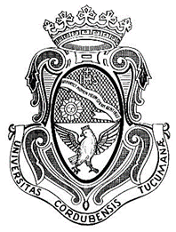
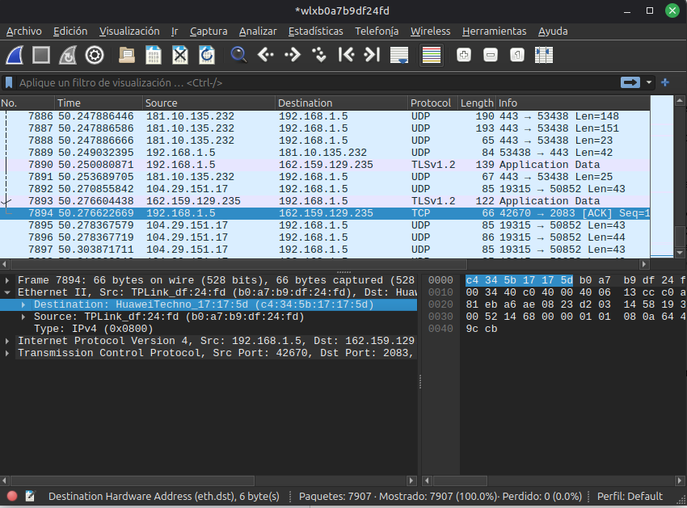
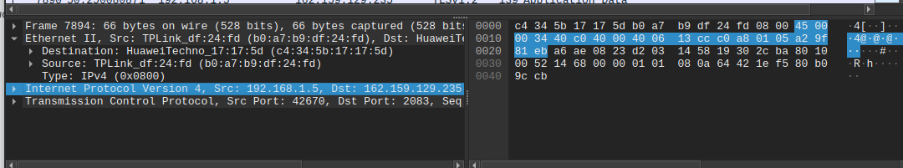
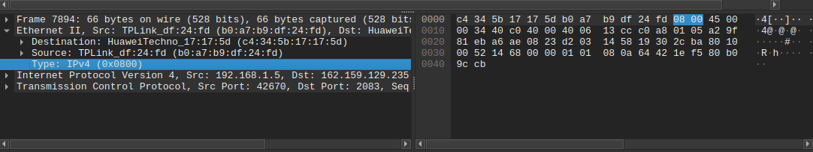
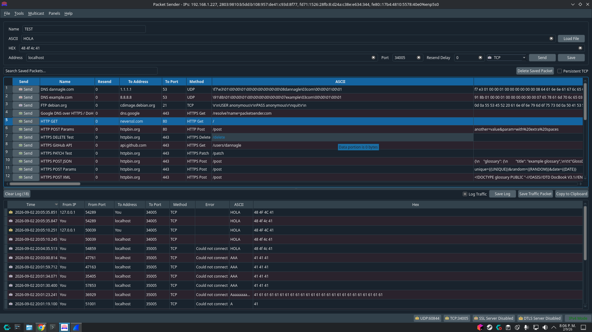
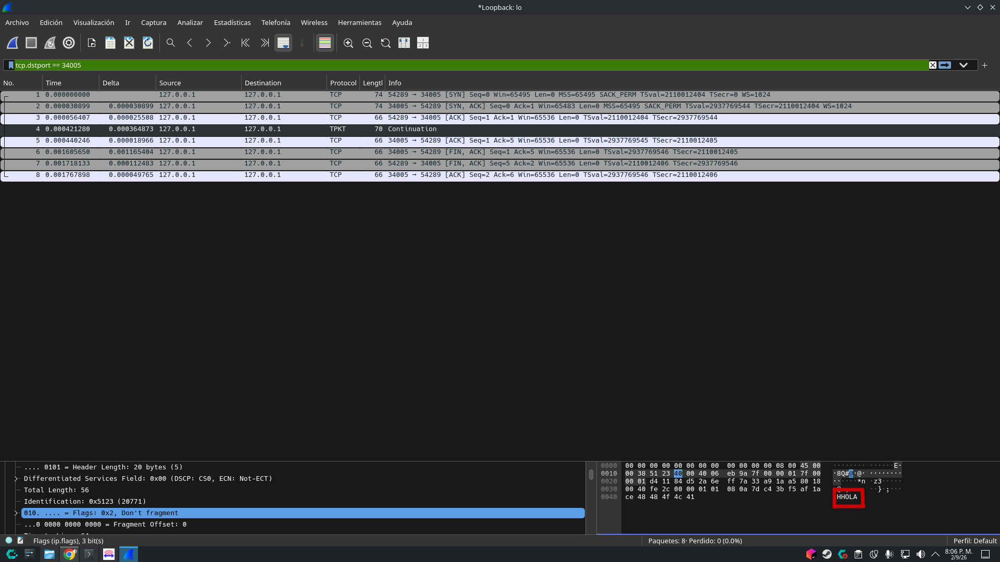
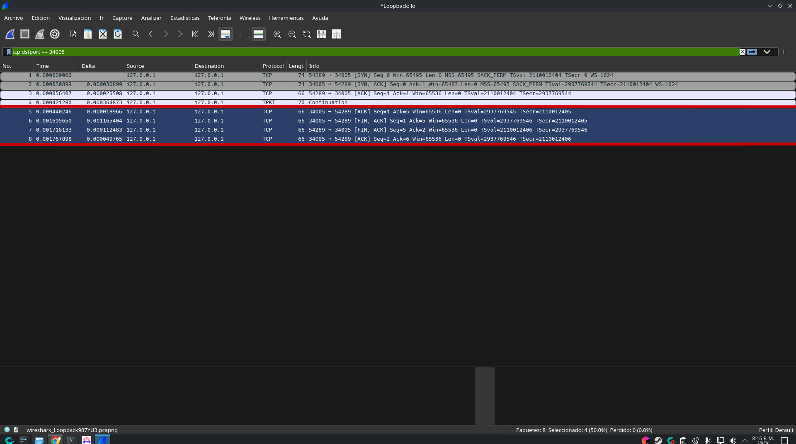
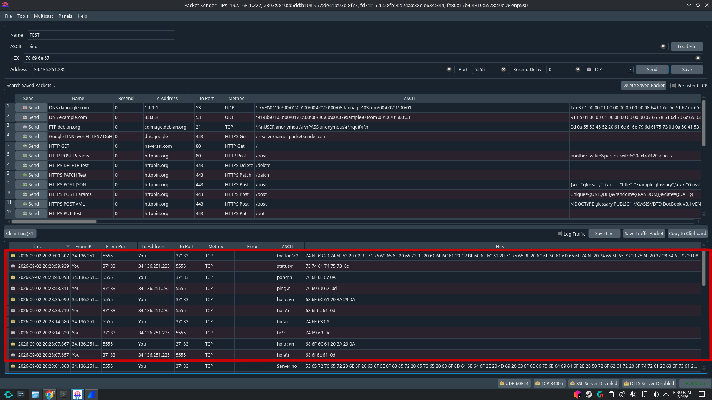
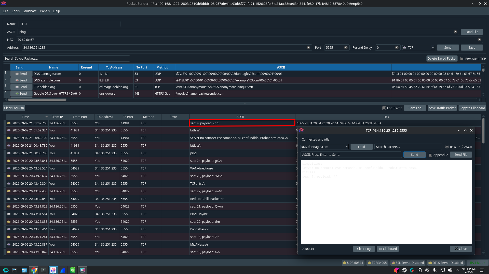

# Universidad Nacional de Córdoba

**Facultad de Ciencias Exactas, Físicas y Naturales**
**Cátedra Redes de Computadora**

## Trabajo Práctico 3

**Alumnos:**

| Nombres                    | DNI      |
|-----------------------------|----------|
| Monetti, Francisco          | 46590584 |
| Toranzo, Hernan             | 44345504 |
| Silva, Jonathan Ariel       | 42641133 |
| Barron Saez, Lautaro        | 44909179 |
| Hernandez, Gonzalo Nicolas  | 42246081 |
| Michaud, Facundo            | 47302808 |

Septiembre 2026

---

## Índice

1. [La información dentro de una red local](#1-la-información-dentro-de-una-red-local)
   - [a) La capa de enlace en el modelo OSI](#a-la-capa-de-enlace-en-el-modelo-osi)
   - [b) La dirección MAC](#b-la-dirección-mac)
   - [c) La trama Ethernet](#c-la-trama-ethernet)
   - [d) Cómo determinar qué protocolo de capa superior transporta una trama Ethernet](#d-cómo-determinar-qué-protocolo-de-capa-superior-transporta-una-trama-ethernet)
2. [Uso de Wireshark](#2-uso-de-wireshark)
   - [a) Identificación de direcciones MAC](#a-identificación-de-direcciones-mac)
   - [b) Identificación del paquete IP](#b-identificación-del-paquete-ip)
   - [c) Comparación de las direcciones MAC e IP](#c-comparación-de-las-direcciones-mac-e-ip)
   - [d) Campo EtherType](#d-campo-ethertype)
3. [Observar el transporte de información mediante TCP](#3-observar-el-transporte-de-información-mediante-tcp)
   - [a) Qué problema resuelve TCP](#a-qué-problema-resuelve-tcp)
   - [b) Campos más importantes de la metadata en un frame TCP](#b-campos-más-importantes-de-la-metadata-en-un-frame-tcp)
   - [c) Three y Four way handshake en TCP](#c-three-y-four-way-handshake-en-tcp)
   - [d) Captura del handshake y análisis del paquete de datos](#d-captura-del-handshake-y-análisis-del-paquete-de-datos)
   - [e) Capturar el Four way handshake](#e-capturar-el-four-way-handshake)
   - [f) Conclusión de la facilidad para ver un paquete en la red](#f-conclusión-de-la-facilidad-para-ver-un-paquete-en-la-red)
4. [Comunicación con el servidor](#4-comunicación-con-el-servidor)

---

## CONSIGNAS

### 1) La información dentro de una red local

#### a) La capa de enlace en el modelo OSI

La función que cumple la capa de enlace dentro del modelo OSI es hacer que el enlace físico entre dos dispositivos sea fiable. El servicio clave que ofrece a las capas superiores es la detección y el control de errores. Si este protocolo de enlace de datos está completamente operativo, la capa inmediatamente superior (la Capa de Red) puede asumir con tranquilidad que la transmisión a través de ese enlace físico está libre de errores. Además, proporciona los mecanismos lógicos necesarios para activar, mantener y desactivar el enlace físico.

La capa de enlace resuelve la comunicación directa enlace a enlace, es decir, la transferencia de datos entre entidades lógicas situadas en nodos físicamente adyacentes. Dado que cada capa de enlace opera de manera independiente únicamente sobre su propio tramo físico, si los dos sistemas finales no están directamente conectados, la capa de enlace no puede asegurar la fiabilidad de la entrega en todo el trayecto. En ese escenario, la comunicación completa constará de múltiples enlaces independientes en serie, delegando la responsabilidad de controlar los errores extremo a extremo a las capas superiores.

#### b) La dirección MAC

Una dirección MAC (Media Access Control) es un identificador de la capa de enlace (capa 2) que se asigna a cada tarjeta de red (NIC) o adaptador de red. Se utiliza para transferir tramas de datos únicamente entre dispositivos directamente conectados dentro de una misma subred física o red local (LAN).

Lo que diferencia una dirección IP de una dirección MAC es la capa en la que operan, mientras la capa MAC opera en la capa 2 (de enlace) la dirección IP opera en la capa 3 (de red).

#### c) La trama Ethernet

Una trama Ethernet es la unidad de datos del protocolo (PDU) que se utiliza en la capa de enlace para encapsular la información y transportarla por el cable físico. El estándar IEEE 802.3 define sus campos de la siguiente manera:

- **Preámbulo (7 octetos):** Consiste en un patrón de bits alternados (unos y ceros: 10101010...) que le permite al receptor sincronizar su reloj con el del emisor para leer correctamente los bits que siguen.
- **Delimitador de comienzo de trama (SFD - Start of Frame Delimiter) (1 octeto):** Contiene la secuencia exacta 10101011. Su función es indicarle al receptor que los bits de sincronización han terminado y que el siguiente bit pertenece al inicio real de la trama.
- **Dirección de destino (DA - Destination Address) (6 octetos):** Especifica la dirección MAC de destino del nodo (o nodos, si es difusión/multidifusión) que debe recibir y copiar la trama.
- **Dirección de origen (SA - Source Address) (6 octetos):** Especifica la dirección MAC de origen de la tarjeta de red que envió la trama originalmente.
- **Longitud / Tipo (2 octetos):** Si la trama sigue la norma IEEE 802.3, indica la longitud en octetos del campo de datos. Si sigue el formato Ethernet II tradicional, contiene el EtherType, indicando qué protocolo de capa superior debe procesar los datos.
- **Datos (46 a 1500 octetos):** Es la carga útil o payload que proviene de la capa superior (usualmente un paquete IP).
- **Relleno (Padding) (variable):** Se añaden octetos adicionales de ceros si el mensaje de datos es menor de 46 bytes, asegurando que la trama cumpla con el tamaño mínimo obligatorio de 64 bytes (necesario para que el mecanismo de colisiones CSMA/CD funcione de manera fiable).
- **Secuencia de comprobación de trama (FCS - Frame Check Sequence) (4 octetos):** Es un código de detección de errores basado en CRC de 32 bits. El receptor realiza el mismo cálculo sobre los campos de la trama recibida y lo compara con este valor; si no coinciden, asume que la trama se dañó en el camino y la descarta.

#### d) Cómo determinar qué protocolo de capa superior transporta una trama Ethernet

La información clave se encuentra en el campo Longitud / Tipo de la cabecera Ethernet. Cuando este campo se utiliza para indicar el Tipo (bajo la especificación Ethernet II), transporta un identificador de 2 bytes conocido como EtherType (por ejemplo, el valor hexadecimal 0x0800 indica que transporta un paquete IPv4, 0x86DD indica IPv6 y 0x0806 indica ARP). En caso de utilizarse el estándar IEEE 802.3 puro, la información sobre el protocolo superior es delegada a la cabecera de la subcapa de control de enlace lógico (LLC) a través de los campos DSAP y SSAP (Service Access Points).

### 2) Uso de Wireshark

#### a) Identificación de direcciones MAC

En este caso primero tenemos la dirección MAC del dispositivo destino, el cual corresponde al módem / router conectado a la PC del experimento. Luego podemos ver la dirección MAC del dispositivo de origen, el cual corresponde a la placa de red Wi-Fi del PC del experimento.

#### b) Identificación del paquete IP

Por lo que podemos ver:

- IP de Origen (Source IP): 192.168.1.5 (dirección IPv4 privada de la computadora utilizada en el experimento).
- IP de Destino (Destination IP): 162.159.129.235 (dirección IPv4 pública del servidor en Internet con el que se está comunicando la aplicación).

#### c) Comparación de las direcciones MAC e IP

No representan lo mismo. La dirección IP identifica el destino final en Internet (el servidor remoto al que queremos llegar), mientras que la dirección MAC solo identifica al dispositivo físico inmediato dentro de nuestra red local. Por eso, aunque la IP de destino es la del servidor web, la MAC de destino es la del router de nuestra casa, ya que el paquete primero debe entregarse físicamente al router para que este lo envíe a Internet.

#### d) Campo EtherType

¿Qué protocolo está encapsulado dentro de la trama analizada?

El protocolo encapsulado es IPv4 (identificado con el valor hexadecimal 0x0800). Este campo le indica a la capa de enlace a qué protocolo de la capa superior (Capa de Red) debe entregarle la carga útil (payload).

### 3) Observar el transporte de información mediante TCP

#### a) Qué problema resuelve TCP

Los problemas que resuelve TCP que no resuelve Ethernet son las limitaciones de un sistema de entrega de paquetes no fiable (IP) y sin conexión (Ethernet). Mientras que Ethernet se limita a transferir tramas entre nodos directamente e IP se encarga del enrutamiento de "mejor esfuerzo" de host a host de forma no fiable, TCP introduce funciones de extremo a extremo indispensables para las aplicaciones:

- **Garantía de entrega fiable** (recuperación de pérdida de paquetes) mediante la técnica de reconocimiento positivo con retransmisión (PAR): el receptor envía un acuse de recibo (ACK) al recibir los datos con éxito y si no se recibe este acuse se retransmiten los datos.
- **Ordenamiento de los datos y eliminación de duplicados** mediante números de secuencia que garantizan la orientación al flujo de bytes.
- **Detección y recuperación de corrupción de datos:** TCP suma a las técnicas CRC de Ethernet para detectar errores de bits y a la técnica de IP de proteger la cabecera con su suma de comprobación; TCP incluye una suma de comprobación (checksum) de 16 bits que cubre cabecera y datos, además de utilizar pseudo cabeceras IP para protegerse de entregas erróneas, descartando los segmentos corruptos para que el mecanismo de retransmisión los recupere.
- **Multiplexación de procesos** (entrega de proceso a proceso): para identificar interfaces de aplicaciones o procesos, TCP introduce el concepto de puertos (identificando las conexiones mediante una tupla de cuatro elementos: IP de origen, puerto de origen, IP de destino y puerto de destino), lo que permite que múltiples aplicaciones en una misma máquina compartan de forma concurrente la red sin interferir entre sí.
- **Control de flujo de extremo a extremo:** TCP proporciona control de flujo mediante un mecanismo de ventana de recepción (sliding window) donde el receptor comunica constantemente al emisor el espacio libre en su buffer (VentRecepcion), asegurando que el emisor nunca envíe más bytes de los que el host de destino puede procesar y almacenar.
- **Control de congestión de la red:** TCP monitoriza el estado de la red e infiere la congestión a partir de la pérdida de paquetes o de la recepción de ACKs duplicados, y en respuesta reduce dinámicamente la velocidad de transmisión aplicando algoritmos como slow start, evitación de congestión y recuperación rápida.
- **Establecimiento de conexiones lógicas:** TCP es orientado a la conexión; antes de que comience el intercambio de datos reales, realiza un acuerdo en tres fases (three-way handshake) para sincronizar los números de secuencia iniciales y verificar que ambos extremos están listos y autorizados para comunicarse.

En resumen, TCP toma el transporte de "mejor esfuerzo" no fiable y sin conexión de IP y Ethernet, y lo transforma en un servicio de transporte de datos fiable, ordenado, libre de duplicados y con flujo controlado directo entre procesos de aplicación.

#### b) Campos más importantes de la metadata en un frame TCP

Los campos más importantes de la metadata en un frame TCP son:

1. **Puerto Origen (16 bits) y Puerto Destino (16 bits):** Identifican las aplicaciones o procesos específicos (puntos de acceso al servicio de transporte) en los respectivos computadores emisor y receptor que se comunican. El puerto de destino permite a la entidad TCP receptora saber a qué aplicación concreta debe entregar los datos (por ejemplo, a una aplicación de correo electrónico).
2. **Número de Secuencia (32 bits):** Indica el número de secuencia del primer octeto de datos que contiene ese segmento. Este campo permite que el receptor reordene los segmentos en caso de que lleguen desordenados.
3. **Número de Confirmación o ACK (Acknowledgment Number, 32 bits):** En el caso que el indicador ACK esté activo, este contiene el número de secuencia del siguiente octeto que la entidad TCP espera recibir del otro extremo. Funciona de manera acumulativa, lo que significa que un número de confirmación AN = X valida que todos los octetos de datos anteriores (hasta X-1) se recibieron correctamente.
4. **Longitud de la cabecera (Data Offset, 4 bits):** Indica la longitud de la cabecera TCP medida en palabras de 32 bits. Es necesario para saber dónde terminan los metadatos y dónde comienzan los datos de usuario reales, ya que el campo de opciones al final de la cabecera puede variar de tamaño.
5. **Indicadores (Flags, 6 bits):** Bits de control individuales que activan funcionalidades y comportamientos específicos de la conexión.
   - **SYN (Synchronize):** Sincroniza los números de secuencia durante el establecimiento de la conexión.
   - **ACK (Acknowledgment):** Indica que el campo de Número de Confirmación de este segmento contiene un valor válido.
   - **FIN (Finish):** Indica que el emisor no enviará más datos y solicita cerrar la conexión.
   - **RST (Reset):** Fuerza el reinicio de la conexión en caso de un error grave, un segmento inválido o desincronización.
   - **PSH (Push):** Fuerza a TCP a transmitir todos los datos acumulados y al receptor a entregarlos a la aplicación, sin esperar que se llene la memoria temporal.
   - **URG (Urgent):** Indica que el segmento posee datos urgentes que deben ser procesados con prioridad por la aplicación de destino.
6. **Ventana (Window, 16 bits):** Especifica la cantidad de octetos de datos que el emisor de este segmento está dispuesto a recibir, comenzando por el número indicado en el campo de confirmación. Es el mecanismo central de control de flujo, que evita que el receptor se sature de datos.
7. **Suma de Comprobación (Checksum, 16 bits):** Es un código de detección de errores que se calcula sobre todo el segmento TCP (cabecera y datos de usuario) junto con una "pseudo cabecera" que contiene información del protocolo IP (como direcciones IP origen/destino). Esto protege a TCP contra errores de bits durante la transmisión física y contra entregas erróneas por parte de la capa de red.
8. **Puntero Urgente (16 bits):** Cuando el indicador URG está activo, este valor se suma al número de secuencia del segmento para indicar la posición exacta del último octeto de datos urgentes.
9. **Opciones (Variable):** Permite añadir parámetros extra y extensiones, tal como acordar el tamaño máximo del segmento (MSS) que una parte puede aceptar en su conexión.

#### c) Three y Four way handshake en TCP

El Three-way handshake (diálogo en tres pasos) y el Four-way handshake (diálogo de cuatro pasos) son los procedimientos normalizados que utiliza el protocolo TCP para establecer y cerrar una conexión lógica de extremo a extremo de manera fiable, haciendo uso de las Flags anteriormente mencionadas.

1. **Three-way handshake (Establecimiento de la conexión):** Se encarga de confirmar que ambos extremos de la conexión existen, negociar parámetros opcionales (como el tamaño máximo de segmento, MSS) y, principalmente, sincronizar los Números de Secuencia Iniciales (ISN) de ambos extremos para evitar que segmentos retrasados u obsoletos de conexiones anteriores interfieran.

   Hace uso de las Flags de la siguiente manera:

   - **SYN:** El sistema emisor (A) inicia una apertura activa enviando un segmento con el indicador SYN activo. Este segmento contiene un número de secuencia inicial aleatorio o variable.
   - **SYN/ACK:** El sistema receptor (B), al recibir el segmento en su puerto en estado de escucha (LISTEN), responde activando los indicadores SYN y ACK. Con el bit ACK, confirma la recepción del SYN de A indicando en el Número de confirmación (AN). Al mismo tiempo, propone su propio número de secuencia inicial en el campo Número de secuencia (SN). El receptor pasa al estado SYN RECEIVED.
   - **ACK:** Al recibir la respuesta, el emisor (A) envía un segmento final con el indicador ACK activo para confirmar el SYN de B, especificando un número de confirmación. Con este último paso, ambos extremos entran en el estado establecido (ESTAB) y quedan listos para una transferencia segura de datos de usuario.

2. **Four-way handshake (Cierre de la conexión):** Se encarga de realizar un cierre ordenado sin pérdida de datos. Esto surge debido a que una conexión TCP es full-duplex (permite la transmisión simultánea en ambos sentidos), por lo que cada canal de transmisión (de A hacia B y de B hacia A) debe cerrarse de manera independiente. Los pasos son:

   - **FIN de A:** Cuando la aplicación en el emisor (A) solicita cerrar la conexión, el TCP local envía un segmento con el indicador FIN activo y cambia al estado FIN WAIT. Esto le comunica a B que A ya no tiene más datos para enviar, pero puede seguir recibiendo los suyos.
   - **ACK de B:** El receptor (B) recibe el segmento FIN, y lo confirma devolviendo un segmento ACK e informa a su aplicación local del cierre. B pasa al estado CLOSE WAIT. Durante esta fase de "cierre a medias", B aún puede seguir transmitiendo datos que tenga pendientes a A, y A los seguirá aceptando y confirmando.
   - **FIN de B:** Una vez que B terminó de transmitir todos sus datos acumulados y su aplicación local también solicita el cierre, B envía su propio segmento con el indicador FIN activo hacia A.
   - **ACK de A:** El emisor (A) recibe el FIN de B y responde con un ACK de confirmación.

   Es importante remarcar que luego del último ACK de A, este no cierra la conexión inmediatamente. Entra en el estado TIME WAIT y espera un intervalo de tiempo antes de pasar finalmente al estado CLOSED. Esto se hace por dos razones críticas: asegurar la llegada del último ACK (si el ACK de A se pierde en la red, B puede retransmitir el segmento FIN y A volver a enviar el ACK) y evitar colisiones con conexiones nuevas (impide que puertos e identificadores de sockets idénticos sean reutilizados inmediatamente, de forma que si hay algún segmento huérfano o retrasado de la conexión anterior, este expire en la red).

#### d) Captura del handshake y análisis del paquete de datos

**PacketSender**

**Wireshark**

Como se puede apreciar en el Packet Sender el paquete enviado es "HOLA", donde en el Wireshark se aprecia el paquete capturado en el borde inferior derecho delimitado por un cuadro rojo.

#### e) Capturar el Four way handshake

El Four-way handshake se aprecia en el Wireshark delimitado de las líneas rojas del screenshot a continuación:

#### f) Conclusión de la facilidad para ver un paquete en la red

Si no se tiene medidas de seguridad extras, un agente malicioso puede capturar información sensible de la red. Esta experiencia nos enseña a tener cuidado con las redes públicas ya que nos deja expuestos.

### 4) Comunicación con el servidor

Se puede observar en el cuadro los mensajes descritos en la consigna "hola", "ping", "tic", "status".

Cuando se envió el nombre de nuestro grupo "bitless" el mensaje de vuelta del servidor fue "seq: 4, payload: //". Adjunto la foto a continuación:

Además, se envió los nombres del resto de nuestros compañeros, recopilamos los mensajes y construimos el siguiente [Link](https://www.youtube.com/watch?v=dQw4w9WgXcQ).
