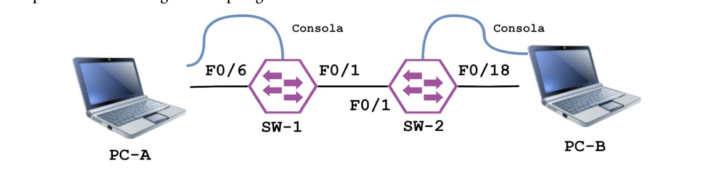

# Universidad Nacional de Córdoba

**Facultad de Ciencias Exactas, Físicas y Naturales**
**Cátedra Redes de Computadora**

## Trabajo Práctico 4

**Alumnos:**

| Nombres                       | DNI        |
|:-----------------------------:|:----------:|
| Monetti, Francisco            | 46590584   |
| Toranzo, Hernan               | 44345504   |
| Silva, Jonathan Ariel         | 42641133   |
| Barron Saez, Lautaro          | 44909179   |
| Hernandez, Gonzalo Nicolas    | 42246081   |
| Michaud, Facundo              | 47302808   |

Septiembre 2026

---

## Índice

1. [Alcance de Redes y Virtualización](#1-alcance-de-redes-y-virtualización)
   - [a) Clasificación de las redes según su alcance](#a-clasificación-de-las-redes-según-su-alcance)
   - [b) Qué es una VLAN y su clasificación](#b-qué-es-una-vlan-y-su-clasificación)
   - [c) El protocolo IEEE 802.1Q](#c-el-protocolo-ieee-8021q)
   - [d) Qué es el Tagging](#d-qué-es-el-tagging)

---

## CONSIGNAS

## 1) Alcance de Redes y Virtualización

### a) Clasificación de las redes según su alcance

A continuación brindaremos una clasificación de las redes, de acuerdo a su alcance, y algunas características de ellas.

|**Criterio**|**Red de Área Local (LAN)**|**Red de Área Metropolitana (MAN)**|**Red de Área Amplia (WAN)**| 
|:---:|:---:|:---:|:---:|
|**Alcance geográfico**| **Restringido:** Una habitación, oficina, edificio o a lo sumo edificios cercanos.|**Intermedio:** Una ciudad, área urbana o metropolitana. |**Extensa**: Una región, país o incluso continente.|
|**Propiedad y gestión**|**Propiedad privada:** Suele pertenecer a la misma entidad o organización que posee los equipos conectados a la red. |**Mixta:** Puede ser pública o privada, con infraestructura propia o alquilada. |**Una fracción significativa de los recursos de la red son ajenos:** Suele requerir circuitos de proveedores de servicios (ISPs).|
|**Velocidad de transmisión**|**Muy elevada:** Desde 10 Mbps hasta 10 Gbps o más en redes de alta velocidad (Ethernet).|**Elevada**: En el orden de las decenas de Mbps hasta a veces velocidades de Gbps, no tan altas.|**Variable:** Desde enlaces de acceso (kbps) a troncales de Gbps (ATM, SONET).|
|**Medios y tecnologías**|Par trenzado (UTP/STP), fibra óptica y conmutadores Capa 2/3.|Fibra óptica, radio direccional, Metro Ethernet|Conmutación de paquetes/circuitos, Frame Relay, ATM, IP|
|**Uso y aplicaciones**|Conectar PCs, servidores departamentales e impresoras en oficinas.|Interconectar múltiples LANs urbanas a un coste menor que el de la telefonía local.|Interconexión global, acceso a Internet y transporte corporativo.|

Cabe destacar que se han mencionado los tipos de redes principales, pero también se encuentran variantes o redes especializadas tales como las WLAN y WAN inalámbricas, las SAN (redes de almacenamiento), las de respaldo, etc.

### b) Qué es una VLAN y su clasificación

Una **VLAN** (red de área local virtual) es una tecnología de redes que permite segmentar una red física en varias redes lógicas más pequeñas. Estas redes más pequeñas pueden denominarse como subredes, y cada una de ellas puede usarse forma diferente, habilitando la opción de que cada una tenga sus propias políticas de seguridad y configuración, así como poder permitir o denegar el tráfico entre las diferentes VLAN gracias a dispositivos L3 como un router o un switch multicapa L3.

Tipos de VLAN:

- **VLAN Nativa (VLAN 1):** Es la VLAN por defecto en un switch, y se encarga de manejar el tráfico que no lleva información con etiqueta de VLAN. Es por esta razón que suele ser usada en entornos de red para gestionar tráfico no etiquetado y facilitar la comunicación entre dispositivos que no están configurados para trabajar dentro de una VLAN.

- **VLAN por etiquetado de tramas (VLAN Tagging, IEEE 802.1Q):** Es el tipo de VLAN más utilizada. En los casos los que el tráfico de múltiples VLANs debe viajar a través de un mismo enlace físico que interconecta varios switch (enlace troncal), se añade un encabezado de etiqueta de 4 bytes (Tag IEEE 802.1Q) a la trama MAC. Esta etiqueta contiene un identificador numérico de VLAN (VLAN ID), lo que permite que el switch receptor sepa a qué VLAN pertenece exactamente cada trama entrante y la entregue solo a los puertos de esa VLAN.

- **VLAN basadas en puerto:** La más utilizada por switches de gama baja. Se asigna cada puerto físico del switch a una VLAN concreta, y cualquier dispositivo que se conecte a ese puerto pertenecerá automáticamente a esa VLAN. Los usuarios dentro de una misma VLAN pueden verse entre sí, pero no a los de VLAN vecinas. Su principal problema es que si un usuario cambia físicamente su puerto en el switch, se debería reconfigurar la VLAN.

- **VLAN basadas en MAC:** En este caso la asignación a la VLAN se realiza según la dirección física MAC de la tarjeta de red del dispositivo final. La principal ventaja es la movilidad: si una persona mueve su laptop a otro puerto, el switch reconoce su dirección MAC y lo mantiene en su VLAN correspondiente de forma transparente. Esto significa que no es necesario reconfigurar el switch o router. Sin embargo, su problema es que el hecho de usar la dirección MAC supone una gran carga administrativa, pues en redes grandes el hecho de mantener una lista con todas las direcciones MAC es un proceso manual.

- **VXLAN:** Es una VLAN extensible. Superpone redes de capa 2 en una infraestructura de capa 3, encapsulando tramas de capa 2 en paquetes UDP. Cada una de estas redes de superposición es conocida como segmento VXLAN, e identificada mediante un identificador único de 24 bits denominado VXLAN Network Identifier (VNI). Los dispositivos solo pueden comunicarse entre sí si se encuentran dentro de la misma VXLAN. El hecho de que la red virtual se encuentre en la capa 2 permite que se abstraiga de toda la red subyacente física.

- **VLAN híbridas:** Es un modo de funcionamiento en switches que combina las capacidades de las VLANs basadas en puertos y etiquetadas. Los paquetes de datos se distribuyen según el etiquetado que se les asigna y, además, la división de la red queda marcada por una conexión intencionada de los puertos.

- **VLAN de gestión:** Es una práctica en el diseño de redes utilizada exclusivamente para la administración de dispositivos de red. Se encarga de crear un entorno aislado (red privada) donde el tráfico relacionado con las operaciones de gestión, configuración y monitoreo de dispositivos pueda fluir sin interferencias del tráfico de datos de usuario (red principal). Esto permite que las actividades de administración se realicen en un entorno controlado, mejorando la seguridad y eficiencia de la red.

- **VLAN de control:** Es usada para transportar tráfico específicamente enfocado a funciones de control de una red. Está diseñada para manejar protocolos que son esenciales para el funcionamiento y mantenimiento de la misma, como los protocolos de enrutamiento y etiquetado. El hecho de separar este tráfico del resto de la red, permite optimizar el rendimiento general y garantizar una gestión más eficiente de los procesos internos.

### c) El protocolo IEEE 802.1Q

El protocolo **IEEE 802.1Q** es el estándar internacional desarrollado por el comité IEEE 802 para definir el etiquetado de tramas Ethernet para soportar VLANs en redes Ethernet. Permite que múltiples redes virtuales compartan un mismo medio físico con el uso de este etiquetado, de forma que no pueda haber interferencias o problemas entre ellas.

### d) Qué es el Tagging

El **Tagging** (etiquetado de tramas) es el proceso de inserción de un encabezado o etiqueta de 4 bytes con información de control dentro de una trama MAC de Ethernet. 

El proceso del tagging es el siguiente: cuando desde una estación llega a un switch una trama MAC convencional sin etiqueta (untagged), este determina a qué VLAN pertenece la estación. En el caso de que la trama deba ser transmitida mediante un enlace troncal hacia otro switch, a la trama se le inserta la etiqueta IEEE 802.1Q después de la dirección MAC de origen que permita identificar a la VLAN mencionada.

Esta etiqueta posee dos campos principales:

- **VLAN ID (VID):** Es un campo de 12 bits que identifica explícitamente la VLAN de origen (límite de 4094 VLANs independientes). 

- **Prioridad de usuario (PCP / 802.1p):** Es un campo de 3 bits que permite clasificar el tráfico para dar tratamiento de calidad de servicio (QoS), de forma de poder priorizar tramas de voz o video sobre otras más convencionales.

Mientras tanto, el proceso de **Untagging** sería el proceso inverso: cuando la Trama (tagged) llega al switch correspondiente al dispositivo de destino, este se encarga de remover la etiqueta 802.1Q, de modo que el dispositivo destino reciba una trama Ethernet estándar, sin tener idea de que la misma pasó por una infraestructura virtual.

## 2) Implementacion de la siguiente topologia en packet-Tracer

### a) Configuracion de switches desde las computadoras 

configuracion desde pc0 a switch1

configuracion desde pc1 a switch2

### b)Asignar contraseñas privilegiadas, de consola y vty.

Desde pc0 a switch1

Desde pc1 a switch2

### c) Encriptacion de las contraseñas

desde las pcs a los switches

 

Desde pc1 a switch2

### d) Configuracion de las redes VLAN para ambos switch según la tabla de direcciones provista.

 

### e) Desconexion de  todas las interfaces que no estén siendo utilizadas

En el switch 1

 

En el switch 2

### f) Guardado de la configuración 
En el switch 1 

 

En el switch 2

### g) Testeo de las comunicaciones entre las computadoras usando pings

desde Pc0 a Pc1

 

desde Pc1 a Pc0

